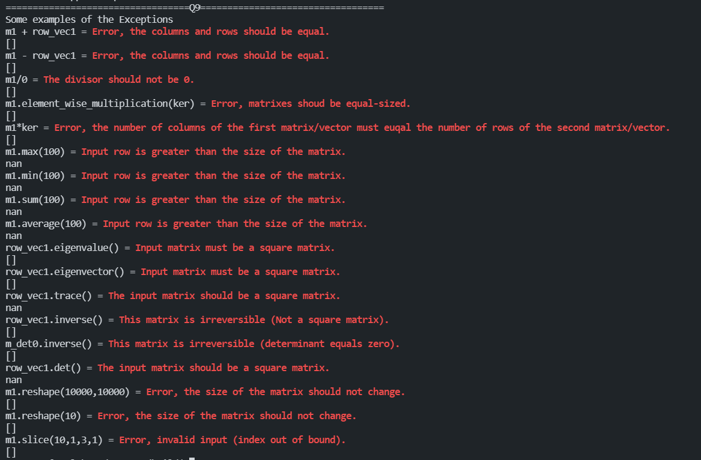

## CS205 C/ C++ Programming Project: Building a library for matrix computation.

>11813211 陈倚天
>
>11813219 吴宇闻
>
>11812214 任振裕

### Description

  Matrix is an important concept introduced in linear algebra. Matrix calculation is widely used in many practical applications, including image processing, machine learning and deep learning. In this project, we do not rely on any existing libraries, instead building a matrix calculation library, which providing serial methods like basic calculation, eigenvalues and eigenvectors, reshape and slicing, and convolution which widely used in image processing (Computer vision).

   Our work can be summarized into nine main inceptions, and the report first illustrates the methods analyses and respective codes, then comprehensive test cases are presented.  

### Usage

`rm -rf build/`

`mkdir build`

`cd build`

`cmake ..`

`make`

`./main`

`./TestCV`

### Part 1: Analysis

+ Two classes and one struct are defined:
  + One class named `Matrix` represents the dense matrix, using a 2-D `vector` to store the elements.
  
    ```c++
    template <class T>
    class Matrix
    {
    private:
        vector<vector<T>> matrix;
        int row, column;  
    };
    ```
  
  + One struct named `Trituple` represents the element of `SMatrix`, storing the indexes and values of the non-zero element for the sparse matrix.
  
    ```c++
    template <class T>
    struct Trituple //Element of Sparse Matrix
    {
        int x, y;
        T val;
        bool operator<(Trituple &other) // Use it to sort the elemnets in the order of xth row, yth column;
        {
            if (x != other.x)
            {
                return x < other.x;
            }
            else
            {
                return y < other.y;
            }
        }
    };
    ```
  
  + One class named `SMatrix` represents the sparse matrix, using one `vector` to store the `Trituple` before.
  
    ```c++
    template <class T>
    class SMatrix
    {
        int row, column;
        int terms, maxTerms;
        vector<Trituple<T>> smatrix;
    };
    ```
  
  + All of the above use `template` to deal with all types of  data.
  
+ For class `Matrix`, all the methods required are implemented.  

+ For class `SMatrix`, we implement the method of addition, insertion, automatic sorting in the constructor and after insertion.

  ```c++
  SMatrix operator+(SMatrix other); // To achieve faster speed, directly handle the vector insted of using method insert. 
  bool insert(int x, int y, T val); // Sorting while also automatically override the existing element.
  bool insert(Trituple<T> other);
  ```

+ We provide the methods of transformations between classes `Matrix` and `SMatrix` using the constructors and between class `Matrix` and `cv::mat`.\

  All the constructors and transform methods are listed below:

  For class `Matrix`:

  ```c++
  Matrix(int row, int column);
  Matrix(vector<vector<T>> vec);
  Matrix(Matrix const &other);
  Matrix(SMatrix<T> &other); // Copy constructor using SMatrix.
  // For simplicity, only consider ans.channels() == 1 for below methods.
  Matrix(cv::Mat other); // Copy constructor using cv::mat.
  Mat Matrix2Mat(int type = 0); // Transfer matrix to cv::mat.
  ```

  For class `SMatrix`:

  ```c++
  SMatrix(int row = 0, int column = 0);
  SMatrix(Matrix<T> &other); // Copy constructor using Matrix.

+ Supported methods for class `Matrix`:
  
  + Matrix and vector arithmetic are supported. (+, -, \*, .\*, /,  $\times$, transposition, conjugation)
  
    ```c++
    Matrix operator+(Matrix other);
    Matrix operator-(Matrix other);
    Matrix operator*(T other);
    friend Matrix operator*(T other1, Matrix other2);
    Matrix operator/(T_other other);
    Matrix transposition();
    Matrix conjugation();
    Matrix element_wise_multiplication(Matrix other);
    Matrix operator*(Matrix other);
    ```
  
  + Descriptive statistics are supported. (max. min. sum, average, all supporting axis-specific and slicing.)
  
    ```c++
    T max(); // max of all matrix
    T max(int col_or_row, bool iscol = false); // axis-wise, default by row
    T min(); // min of all matrix
    T min(int col_or_row, bool iscol = false); // axis-wise, default by row
    T sum(); // Sum all items.
    T sum(int col_or_row, bool iscol = false); // axis-wise, default by row
    T average(); // Average all.
    T average(int col_or_rol, bool iscol = false); // axis-wise, default by row
    ```
  
  + Calculating eigenvalues and eigenvectors are supported.
  
    ```c++
    Matrix eigenvalue();
    Matrix eigenvector();
    ```
  
  + Calculating traces, inverse and determinant are supported.
  
    ```c++
    T trace();
    Matrix inverse();
    T det();
    Matrix subMatrix(int m, int n) // Use it to calculate determinant. (m,n)的代数余子式矩阵
    ```
  
  + Operations of reshape, slicing, and convolution are supported.
  
    ```c++
    Matrix reshape(int m, int n);
    Matrix reshape(int col_or_row, bool iscol = false); // axis-wise, default by row
    // Slice 左闭右闭
    Matrix slice(int start_row, int start_col, int end_row, int end_col);
    Matrix convolution(Matrix kernel);
    ```
  
+ For both classes, override the operator `<<` to show the matrix.
  
+ Methods all of above are well defined with comprehensive exception handling.

  ```c++
  demo:
  cerr << "\033[31;1mError, invalid input (index out of bound).\033[0m" << endl;
  ```

### Part 2: Code

`Matrix.hpp`

```c++
#ifndef MATRIX_HPP
#define MATRIX_HPP

#include <iostream>
#include <vector>
#include <complex>
#include <cmath>
#include <opencv2/opencv.hpp>

using namespace std;
using namespace cv;

template <class T>
struct Trituple //Element of Sparse Matrix
{
    int x, y;
    T val;
    bool operator<(Trituple &other) // Use it to sort the elemnets in the order of xth row, yth column;
    {
        if (x != other.x)
        {
            return x < other.x;
        }
        else
        {
            return y < other.y;
        }
    }
};

template <typename T>
bool operator!=(complex<T> com, int w)
{
    if (com.real() == w && com.imag() == 0)
    {
        return false;
    }
    else
    {
        return true;
    }
}

template <class T>
class SMatrix;

template <class T>
class Matrix
{
private:
    vector<vector<T>> matrix;
    int row, column;

public:
    Matrix() : row(0), column(0) { matrix.resize(0); }
    Matrix(int row, int column)
    {
        this->row = row;
        this->column = column;
        this->matrix.resize(row);
        for (int i = 0; i < row; i++)
        {
            this->matrix[i].resize(column);
        }
    }
    // Use a 2-D vector to initialize the matrix;
    Matrix(vector<vector<T>> vec)
    {
        this->row = vec.size();
        this->column = vec[0].size();
        this->matrix = vec;
    }
    // Copy constructor;
    Matrix(Matrix const &other)
    {
        this->row = other.row;
        this->column = other.column;
        this->matrix = other.matrix;
    }
    Matrix(SMatrix<T> &other)
    {
        row = other.getRow();
        column = other.getColumn();
        matrix.resize(row);
        for (int i = 0; i < row; i++)
        {
            this->matrix[i].resize(column);
        }
        for (Trituple<T> &t : other.getSMatrixList())
        {
            matrix[t.x][t.y] = t.val;
        }
    }
    // Override operator [] to retrieve the vector;
    vector<T> &operator[](int i)
    {
        if (i >= row)
        {
            cerr << "\033[31;1mIndex out of bound for row.\033[0m" << endl;
            abort();
        }
        return matrix[i];
    }
    int getRow()
    {
        return row;
    }
    int getColumn()
    {
        return column;
    }
    // Matrix addition
    Matrix operator+(Matrix other)
    {
        if (other.getColumn() != column || other.getRow() != row)
        {
            cerr << "\033[31;1mError, the columns and rows should be equal.\033[0m" << endl;
            return Matrix(0, 0);
        }
        Matrix answer(row, column);
        for (int i = 0; i < row; i++)
        {
            for (int j = 0; j < column; j++)
            {
                answer[i][j] = matrix[i][j] + other.matrix[i][j];
            }
        }
        return answer;
    }
    // Matrix substraction
    Matrix operator-(Matrix other)
    {
        return (*this + (other*(-1.0)));
    }
    // Scalar multiplication
    Matrix operator*(T other)
    {
        Matrix answer(row, column);
        for (int i = 0; i < row; i++)
        {
            for (int j = 0; j < column; j++)
            {
                answer[i][j] = matrix[i][j] * other;
            }
        }
        return answer;
    }
    friend Matrix operator*(T other1, Matrix other2)
    {
        Matrix answer(other2.row, other2.column);
        for (int i = 0; i < other2.row; i++)
        {
            for (int j = 0; j < other2.column; j++)
            {
                answer[i][j] = other2[i][j] * other1;
            }
        }
        return answer;
    }
    // Scalar division
    template <class T_other>
    Matrix operator/(T_other other)
    {
        if (other == 0)
        {
            cerr << "\033[31;1mThe divisor should not be 0.\033[0m" << endl;
            return Matrix(0, 0);
        }
        return (*this * (1.0 / other));
    }
    // Tranpostion
    Matrix transposition()
    {
        Matrix answer(column, row);
        for (int i = 0; i < column; i++)
        {
            for (int j = 0; j < row; j++)
            {
                answer[i][j] = matrix[j][i];
            }
        }
        return answer;
    }
    // Conjugation
    Matrix conjugation()
    {
        // Only applicable for complex matrix.
        Matrix answer(row, column);
        for (int i = 0; i < row; i++)
        {
            for (int j = 0; j < column; j++)
            {
                answer[i][j] = conj(matrix[i][j]);
            }
        }
        return answer;
    }
    // Element-wise multiplication
    Matrix element_wise_multiplication(Matrix other)
    {
        if (other.column != column || other.row != other.row)
        {
            cerr << "\033[31;1mError, matrixes shoud be equal-sized.\033[0m" << endl;
            return Matrix(0, 0);
        }
        Matrix answer(row, column);
        for (int i = 0; i < row; i++)
        {
            for (int j = 0; j < column; j++)
            {
                answer[i][j] = matrix[i][j] * other[i][j];
            }
        }
        return answer;
    }
    // Matrix-matrix multiplication
    Matrix operator*(Matrix other)
    {
        if (column != other.row)
        {
            cerr << "\033[31;1mError, the number of columns of the first matrix/vector must euqal the number of rows of the second matrix/vector.\033[0m" << endl;
            return Matrix(0, 0);
        }
        Matrix answer(row, other.column);
        for (int i = 0; i < row; i++)
        {
            for (int j = 0; j < other.column; j++)
            {
                for (int count = 0; count < column; count++)
                {
                    answer[i][j] += matrix[i][count] * other[count][j];
                }
            }
        }
        return answer;
    }
    // Max
    T max() // max of all matrix
    {
        T max = matrix[0][0];
        for (int i = 0; i < row; i++)
        {
            for (int j = 0; j < column; j++)
            {
                if (matrix[i][j] > max)
                {
                    max = matrix[i][j];
                }
            }
        }
        return max;
    }
    T max(int col_or_row, bool iscol = false)
    {
        T max;
        if (iscol) // Max a column
        {
            if (col_or_row >= column)
            {
                cerr << "\033[31;1mInput column is greater than the size of the matrix.\033[0m" << endl;
                return NAN;
            }
            max = matrix[0][col_or_row];
            for (int i = 0; i < row; i++)
            {
                if (matrix[i][col_or_row] > max)
                {
                    max = matrix[i][col_or_row];
                }
            }
        }
        else // Max a row
        {
            if (col_or_row >= row)
            {
                cerr << "\033[31;1mInput row is greater than the size of the matrix.\033[0m" << endl;
                return NAN;
            }
            max = matrix[col_or_row][0];
            for (int i = 0; i < column; i++)
            {
                if (matrix[col_or_row][i] > max)
                {
                    max = matrix[col_or_row][i];
                }
            }
        }
        return max;
    }
    // Min
    T min() // min of all matrix
    {
        T min = matrix[0][0];
        for (int i = 0; i < row; i++)
        {
            for (int j = 0; j < column; j++)
            {
                if (matrix[i][j] < min)
                {
                    min = matrix[i][j];
                }
            }
        }
        return min;
    }
    T min(int col_or_row, bool iscol = false)
    {
        T min;
        if (iscol) // Min a column
        {
            if (col_or_row >= column)
            {
                cerr << "\033[31;1mInput column is greater than the size of the matrix.\033[0m" << endl;
                return NAN;
            }
            min = matrix[0][col_or_row];
            for (int i = 0; i < row; i++)
            {
                if (matrix[i][col_or_row] < min)
                {
                    min = matrix[i][col_or_row];
                }
            }
        }
        else // Min a row
        {
            if (col_or_row >= row)
            {
                cerr << "\033[31;1mInput row is greater than the size of the matrix.\033[0m" << endl;
                return NAN;
            }
            min = matrix[col_or_row][0];
            for (int i = 0; i < column; i++)
            {
                if (matrix[col_or_row][i] < min)
                {
                    min = matrix[col_or_row][i];
                }
            }
        }
        return min;
    }
    // Sum
    T sum() // Sum all items.
    {
        T answer = 0;
        for (int i = 0; i < row; i++)
        {
            for (int j = 0; j < column; j++)
            {
                answer += matrix[i][j];
            }
        }
        return answer;
    }
    T sum(int col_or_row, bool iscol = false)
    {
        T answer = 0;
        if (iscol) // Sum a column
        {
            if (col_or_row >= column)
            {
                cerr << "\033[31;1mInput column is greater than the size of the matrix.\033[0m" << endl;
                return NAN;
            }
            for (int i = 0; i < row; i++)
            {
                answer += matrix[i][col_or_row];
            }
        }
        else // sum a row
        {
            if (col_or_row >= row)
            {
                cerr << "\033[31;1mInput row is greater than the size of the matrix.\033[0m" << endl;
                return NAN;
            }
            for (int i = 0; i < column; i++)
            {
                answer += matrix[col_or_row][i];
            }
        }
        return answer;
    }
    // Avg
    T average() // Average all.
    {
        return max() / (row * column);
    }
    T average(int col_or_rol, bool iscol = false)
    {
        return iscol ? sum(col_or_rol, iscol) / row : sum(col_or_rol, iscol) / column;
    }
    // Eigenvalue
    Matrix eigenvalue()
    {
        if (row != column)
        {
            cerr << "\033[31;1mInput matrix must be a square matrix.\033[0m" << endl;
            return Matrix(0, 0);
        }
        Mat myMat = Matrix2Mat(CV_64F);
        Mat eValuesMat;
        Mat eVectorsMat;
        eigen(myMat, eValuesMat, eVectorsMat);
        return Matrix(eValuesMat);
    }
    // Eigenvector
    Matrix eigenvector()
    {
        if (row != column)
        {
            cerr << "\033[31;1mInput matrix must be a square matrix.\033[0m" << endl;
            return Matrix(0, 0);
        }
        Mat myMat = Matrix2Mat(CV_64F);
        Mat eValuesMat;
        Mat eVectorsMat;
        eigen(myMat, eValuesMat, eVectorsMat);
        return Matrix(eVectorsMat);
    }
    // Traces
    T trace()
    {
        if (column != row)
        {
            cerr << "\033[31;1mThe input matrix should be a square matrix.\033[0m" << endl;
            return NAN;
        }
        T answer = 0;
        for (int i = 0; i < column; i++)
        {
            answer += matrix[i][i];
        }
        return answer;
    }
    // Inverse
    Matrix inverse()
    {
        if (column != row)
        {
            cerr << "\033[31;1mThis matrix is irreversible (Not a square matrix).\033[0m" << endl;
            return Matrix(0, 0);
        }
        T deter = det();
        if (deter == 0)
        {
            cerr << "\033[31;1mThis matrix is irreversible (determinant equals zero).\033[0m" << endl;
            return Matrix(0, 0);
        }
        Matrix answer(column, column);
        for (int i = 0; i < column; i++)
        {
            for (int j = 0; j < column; j++)
            {
                answer[j][i] = pow(-1, i + j) * subMatrix(i, j).det() / deter;
            }
        }
        return answer;
    }
    // Determinant
    T det()
    {
        T sum = 0;
        if (row != column)
        {
            cout << "\033[31;1mThe input matrix should be a square matrix.\033[0m" << endl;
            return NAN;
        }
        if (column == 1)
        {
            return matrix[0][0];
        }
        else
        {
            for (int i = 0; i < column; i++)
            {
                Matrix subMat = subMatrix(0, i);
                sum += matrix[0][i] * pow(-1, i) * subMat.det();
            }
        }
        return sum;
    }
    Matrix subMatrix(int m, int n) // Use it to calculate determinant. (m,n)的代数余子式矩阵
    {
        Matrix answer(column - 1, column - 1);
        for (int i = 0; i < column - 1; i++)
        {
            for (int j = 0; j < column - 1; j++)
            {
                if (i < m)
                {
                    if (j < n)
                    {
                        answer[i][j] = matrix[i][j];
                    }
                    else
                    {
                        answer[i][j] = matrix[i][j + 1];
                    }
                }
                else
                {
                    if (j < n)
                    {
                        answer[i][j] = matrix[i + 1][j];
                    }
                    else
                    {
                        answer[i][j] = matrix[i + 1][j + 1];
                    }
                }
            }
        }
        return answer;
    }
    // Reshape
    // reshape(m,n)指定m行n列; reshape(m)指定m行; reshape(m,true)指定m列。
    Matrix reshape(int m, int n)
    {
        // Reshape the matrix;
        if (m * n != row * column)
        {
            cerr << "\033[31;1mError, the size of the matrix should not change.\033[0m" << endl;
            return Matrix(0, 0);
        }
        Matrix answer(m, n);
        int count = 0;
        while (count < row * column)
        {
            int j = count / row;
            int i = count % row;
            int ansColumn = count / m;
            int ansRow = count % m;
            answer[ansRow][ansColumn] = matrix[i][j];
            count++;
        }
        return answer;
    }
    Matrix reshape(int col_or_row, bool iscol = false)
    {
        int m, n;
        if (iscol == false)
        {
            m = col_or_row;
            if (row * column % m == 0)
            {
                n = row * column / m;
            }
            else
            {
                cerr << "\033[31;1mError, the size of the matrix should not change.\033[0m" << endl;
                return Matrix(0, 0);
            }
        }
        else
        {
            n = col_or_row;
            if (row * column % n == 0)
            {
                m = row * column / n;
            }
            else
            {
                cerr << "\033[31;1mError, the size of the matrix should not change.\033[0m" << endl;
                return Matrix(0, 0);
            }
        }
        // Reshape the matrix;
        Matrix answer(m, n);
        int count = 0;
        while (count < row * column)
        {
            int j = count / row;
            int i = count % row;
            int ansColumn = count / m;
            int ansRow = count % m;
            answer[ansRow][ansColumn] = matrix[i][j];
            count++;
        }
        return answer;
    }
    // Slice 左闭右闭
    Matrix slice(int start_row, int start_col, int end_row, int end_col)
    {
        if (start_row < 0 || start_col < 0 || start_row >= row || start_col >= column || end_row < 0 || end_col < 0 || end_row >= row || end_col >= column)
        {
            cerr << "\033[31;1mError, invalid input (index out of bound).\033[0m" << endl;
            return Matrix(0, 0);
        }
        int x1, y1, x2, y2;
        if (start_row > end_row)
        {
            x1 = end_row;
            x2 = start_row;
        }
        else
        {
            x2 = end_row;
            x1 = start_row;
        }
        if (start_col > end_col)
        {
            y1 = end_col;
            y2 = start_col;
        }
        else
        {
            y2 = end_col;
            y1 = start_col;
        }
        Matrix answer(x2 - x1 + 1, y2 - y1 + 1);
        for (int i = 0; i < answer.row; i++)
        {
            for (int j = 0; j < answer.column; j++)
            {
                answer[i][j] = matrix[x1 + i][y1 + j];
            }
        }
        return answer;
    }

    // Convolution
    // Reference for convolution: https://blog.csdn.net/qq_32846595/article/details/79053277
    // Use zeros to complete the origin matrix
    Matrix convolution(Matrix kernel)
    {
        kernel = kernel.transposition().transposition(); // 翻转180度
        // center
        int x = kernel.row / 2;
        int y = kernel.column / 2;
        Matrix ans = Matrix(row, column);
        for (int i = 0; i < row; i++)
        {
            for (int j = 0; j < column; j++)
            {
                for (int m = 0; m < kernel.row; m++) // kernel rows
                {
                    for (int n = 0; n < kernel.column; n++) // kernel columns
                    {
                        int ii = i + (m - x);
                        int jj = j + (n - y);
                        // ignore input samples which are out of bound
                        if (ii >= 0 && ii < row && jj >= 0 && jj < column)
                        {
                            ans[i][j] += matrix[ii][jj] * kernel[m][n];
                            // cout << i <<" " <<j <<" "<< matrix[ii][jj] << " " << kernel[m][n] << endl;
                        }
                    }
                }
            }
        }
        return ans;
    }
    // Opencv mat to Matrix
    /*
    CV的宏定义 
    #define CV_8U   0
    #define CV_8S   1
    #define CV_16U  2
    #define CV_16S  3
    #define CV_32S  4
    #define CV_32F  5
    #define CV_64F  6
    #define CV_16F  7 */
    Matrix(cv::Mat other) //For simplicity, only consider the case other.channels() == 1.
    {
        row = other.rows;
        column = other.cols * other.channels(); //Opencv mat element could have several channels. For example, RGB represents 3 channels;
        this->matrix.resize(row);
        for (int i = 0; i < row; i++)
        {
            this->matrix[i].resize(column);
        }
        for (int i = 0; i < other.rows; i++) // cv row
        {
            for (int j = 0; j < other.cols; j++) // cv col
            {
                for (int k = 0; k < other.channels(); k++) //cv channel
                {
                    switch (other.type() % 8)
                    {
                    case 0:
                        matrix[i][j + k] = other.at<uchar>(i, j);
                        break;
                    case 1:
                        matrix[i][j + k] = other.at<char>(i, j);
                        break;
                    case 2:
                        matrix[i][j + k] = other.at<ushort>(i, j);
                        break;
                    case 3:
                        matrix[i][j + k] = other.at<short>(i, j);
                        break;
                    case 4:
                        matrix[i][j + k] = other.at<int>(i, j);
                        break;
                    case 5:
                        matrix[i][j + k] = other.at<float>(i, j);
                        break;
                    case 6:
                        matrix[i][j + k] = other.at<double>(i, j);
                        break;
                    case 7:
                        matrix[i][j + k] = other.at<double>(i, j);
                        break;
                    default:
                        break;
                    }
                }
            }
        }
    }
    // Matrix to mat
    Mat Matrix2Mat(int type = 0) //For simplicity, only consider ans.channels() == 1
    {
        Mat answer = Mat::zeros(row, column, type);
        for (int i = 0; i < row; i++)
        {
            for (int j = 0; j < column; j++)
            {
                switch (type)
                {
                case 0:
                    answer.at<uchar>(i, j) = matrix[i][j];
                    break;
                case 1:
                    answer.at<char>(i, j) = matrix[i][j];
                case 2:
                    answer.at<ushort>(i, j) = matrix[i][j];
                    break;
                case 3:
                    answer.at<short>(i, j) = matrix[i][j];
                case 4:
                    answer.at<int>(i, j) = matrix[i][j];
                case 5:
                    answer.at<float>(i, j) = matrix[i][j];
                case 6:
                    answer.at<double>(i, j) = matrix[i][j];
                case 7:
                    answer.at<double>(i, j) = matrix[i][j];
                default:
                    break;
                }
            }
        }
        return answer;
    }
    // Override << to show the matrix;
    friend ostream &operator<<(ostream &os, Matrix other)
    {
        os << "[";
        for (int i = 0; i < other.row; i++)
        {
            if (i != 0)
            {
                os << " ";
            }
            for (int j = 0; j < other.column; j++)
            {
                os << other.matrix[i][j];
                if (j != other.column - 1)
                {
                    os << ", ";
                }
            }
            if (i != other.row - 1)
            {
                os << endl;
            }
        }
        os << "]";
        return os;
    }
};

template <class T>
class SMatrix
{
private:
    int row, column;
    int terms, maxTerms;
    vector<Trituple<T>> smatrix;

public:
    SMatrix() : row(0), column(0), terms(0), maxTerms(0) {}
    SMatrix(int row = 0, int column = 0) : terms(0), maxTerms(0)
    {
        this->row = row;
        this->column = column;
        this->maxTerms = row * column;
    }
    // 使用自己定义的Matirx声明
    SMatrix(Matrix<T> &other) : terms(0)
    {
        row = other.getRow();
        column = other.getColumn();
        maxTerms = row * column;
        for (int i = 0; i < other.getRow(); i++)
        {
            for (int j = 0; j < other.getColumn(); j++)
            {
                if (other[i][j] != 0)
                {
                    smatrix.push_back(Trituple<T>{i, j, other[i][j]});
                    terms++;
                }
            }
        }
    }
    vector<Trituple<T>> getSMatrixList()
    {
        return smatrix;
    }
    int getRow()
    {
        return row;
    }
    int getColumn()
    {
        return column;
    }
    int getTerms()
    {
        return terms;
    }
    bool insert(int x, int y, T val) // 插入元素
    {
        Trituple<T> other;
        other.x = x;
        other.y = y;
        other.val = val;
        return insert(other);
    }
    bool insert(Trituple<T> other) // 插入元素
    {
        if (other.x < 0 || other.x >= row || other.y < 0 || other.y >= column || terms >= maxTerms)
        {
            return false;
        }
        for (Trituple<T> &t : smatrix) // 去除重复元素
        {
            if (t.x == other.x && t.y == other.y)
            {
                t.val = other.val;
                return true;
            }
        }
        terms++;
        smatrix.push_back(other);
        sort(smatrix.begin(), smatrix.end());
        return true;
    }
    SMatrix operator+(SMatrix other)
    {
        if (row != other.row || column != other.column)
        {
            cerr << "\033[31;1mError, the columns and rows should be equal.\033[0m" << endl;
            return SMatrix(0, 0);
        }
        SMatrix answer(other.row, other.column);
        auto it1 = smatrix.begin();
        auto it2 = other.smatrix.begin();
        while (it1 < smatrix.end() || it2 < other.smatrix.end())
        {
            if (it1 < smatrix.end() && it2 < other.smatrix.end())
            {
                if (it1->x == it2->x && it1->y == it2->y)
                {
                    if(it1->val + it2->val != 0)
                    {
                        answer.smatrix.push_back(Trituple<T>{it1->x, it1->y, it1->val + it2->val});
                        answer.terms++;
                    }
                    it1++;
                    it2++;
                }
                else
                {
                    if (*it1 < *it2)
                    {
                        answer.smatrix.push_back(*it1);
                        answer.terms++;
                        it1++;
                    }
                    else
                    {
                        answer.smatrix.push_back(*it2);
                        answer.terms++;
                        it2++;
                    }
                }
            }
            else
            {
                if(it1 < smatrix.end())
                {
                    answer.smatrix.push_back(*it1);
                    answer.terms++;
                    it1++;
                }
                if(it2 < other.smatrix.end())
                {
                    answer.smatrix.push_back(*it2);
                    answer.terms++;
                    it2++;
                }
            }
        }
        return answer;
    }
    friend ostream &operator<<(ostream &os, SMatrix other)
    {
        os << "INFORMATION: Row = " << other.row << ", column = " << other.column << ", number of terms = " << other.terms << ". Items are listed below: " << endl;
        if (other.terms == 0)
        {
            os << "[]";
            return os;
        }
        for (int i = 0; i < other.terms - 1; i++)
        {
            os << i + 1 << ": "
               << "SMatrix[" << other.smatrix[i].x << "][" << other.smatrix[i].y << "] = " << other.smatrix[i].val << endl;
        }
        os << other.terms << ": "
           << "SMatrix[" << other.smatrix[other.terms - 1].x << "][" << other.smatrix[other.terms - 1].y << "] = " << other.smatrix[other.terms - 1].val;
        return os;
    }
};
#endif
```

`main.cpp`

```c++
#include <iostream>
#include <opencv2/core.hpp>
#include "Matrix.hpp"
#include <complex>
#include <ctime>

using namespace std;
using namespace cv;

int main()
{
    // Q1,Q2
    cout << "==================================Q1,Q2==================================" << endl;
    vector<vector<double>> vec1 = {{1.1, 2.2, 3, 4}, {5, 6, 7, 8}, {9, 1, 1, 2}, {3, 4, 5, 6}};
    Matrix<double> m1(vec1);
    vector<vector<double>> vec2 = {{1, 1, 8, 1}, {2, 2, 1, 4}, {1, 1, 8, 1}, {3, 2, 1, 9}};
    Matrix<double> m2(vec2);
    vector<vector<complex<double>>> com1 = {{complex<double>(1, 2), 3, 4}, {5, 6, complex<double>(7, 8)}, {complex<double>(9, 2), complex<double>(3, 6), 4}};
    Matrix<complex<double>> com_m(com1);
    vector<vector<double>> row1 = {{1, 2, 3, 4, 5, 6, 7, 8, 9}};
    Matrix<double> row_vec1(row1);
    vector<vector<double>> row2 = {{9, 8, 7, 6, 5, 4, 3, 2, 1}};
    Matrix<double> row_vec2(row2);
    vector<vector<double>> col1 = {{1}, {2}, {3}, {4}, {5}, {6}, {7}, {8}, {9}};
    Matrix<double> col_vec1(col1);
    vector<vector<double>> col2 = {{9}, {8}, {7}, {6}, {5}, {4}, {3}, {2}, {1}};
    Matrix<double> col_vec2(col2);
    vector<vector<double>> col3 = {{9}, {8}, {7}, {6}};
    Matrix<double> col_vec3(col3);
    cout << "Matrix double m1 = \n"
         << m1 << endl;
    cout << "Matrix int m2 = \n"
         << m2 << endl;
    cout << "complex matrix com_m =\n"
         << com_m << endl;
    cout << "row_vec1 = \n"
         << row_vec1 << endl;
    cout << "row_vec2 = \n"
         << row_vec2 << endl;
    cout << "col_vec1 = \n"
         << col_vec1 << endl;
    cout << "col_vec2 = \n"
         << col_vec2 << endl;
    cout << "col_vec3 = \n"
         << col_vec3 << endl;


    // Q3
    cout << "==================================Q3==================================" << endl;
    // Addition
    cout << "Matrix addition: m1 + m2 = \n"
         << (m1 + m2) << endl;
    // Substraction
    cout << "Matrix substraction: m1 - m2 = \n"
         << (m1 - m2) << endl;
    // scalar multiplication
    cout << "Scalar multiplication: m1 * 2.0 = \n"
         << (m1 * 2.0) << endl;
    // cout <<"2.0 * m1 = \n" << (2.0 * m1) << endl;
    // scalar division
    cout << "Scalar division: m1 / 2.0 = \n"
         << (m1 / 2.0) << endl;
    // tranposition
    cout << "Transposition of m1 = \n"
         << m1.transposition() << endl;
    cout << "Transposition of row_vec1 = \n"
         << row_vec1.transposition() << endl;
    // conjugation
    cout << "Conjugation of complex matrix com_m = \n"
         << com_m.conjugation() << endl;
    //element-wise multiplication

    cout << "Element wise multiplication of m1 and m2 = \n"
         << m1.element_wise_multiplication(m2) << endl;
    cout << "Element wise multiplication of row_vec1 and row_vec2 = \n"
         << row_vec1.element_wise_multiplication(row_vec2) << endl;
    // matrix matrix multiplication
    cout << "Matrix-matrix multiplictaion of m1 and m2 = \n"
         << (m1 * m2) << endl;
    // matrix vector multiplication
    cout << "Matrix-vector multiplictaion of m1 and col_vec3 = \n"
         << (m1 * col_vec3) << endl;
    // column vector and row vector multiplication
    cout << "Column-row vector multiplication between col_vec1 and row_vec1 = \n"
         << (col_vec1 * row_vec1) << endl;


    // Sparse Matrix
    cout << "==================================Sparse matrix==================================" << endl;
    SMatrix<double> sm1(4, 4);
    cout << "The spare matrix sm1 is: " << sm1 << endl;
    sm1.insert(1, 1, 2);
    cout << "Insert a element (1,1), with value 2 : " << sm1 << endl;
    sm1.insert(1, 1, 1); // 去除重复
    cout << "Update a element (1,1), with value 1 : " << sm1 << endl;
    // 排序
    sm1.insert(0, 3, 5);
    sm1.insert(2, 1, 7);
    sm1.insert(2, 2, 4);
    cout << "The order of the matrix element will not depend on the insert: " << sm1 << endl;

    sm1.insert(Trituple<double>{3, 1, 4}); //也可以插入定义的Struct Trituple
    sm1.insert(100, 100, 1);               //越界插入失败，返回false
    cout << "sm1 = \n"
         << sm1 << endl;

    // SMatrix与Matrix互转
    //使用Matrix声明SMatrix
    vector<vector<double>> vecs = {{0, 0, 3, 4}, {5, -1, 0, 0}, {9, 0, 0, 2}, {3, 0, 0, 6}};
    Matrix<double> ms(vecs);
    SMatrix<double> sm2(ms);
    cout << "Using a matrix to delcare the sparse matrix: \n";
    cout << "sm2 = \n"
         << sm2 << endl;
    //使用SMatrix声明Matrix
    Matrix<double> m_from_sparse(sm2);
    cout << "SMatrix to Matrix: \n" << m_from_sparse << endl;
    // SMatrix + SMatrix
    cout << "Addition of sparse matrix:\n" << (sm1 + sm2) << endl;
    //Compare the running time.
    cout << "Compare the time of sm1+sm2 and m1+m2" << endl;
    clock_t start_time, end_time;
    start_time = clock();
    SMatrix<double> sm1_add_sm2 = sm1 + sm2;
    end_time = clock();
    double t_sp = (double)(end_time - start_time) / CLOCKS_PER_SEC;
    cout << "Under sparse representation the calculating time is " << t_sp << "s" << endl;
    clock_t start_time2, end_time2;
    start_time2 = clock();
    Matrix<double> m1_add_m2 = m1 + m2;
    end_time2 = clock();
    double t_dense = (double)(end_time2 - start_time2) / CLOCKS_PER_SEC;
    cout << "Under denses representation the calculating time is " << t_dense << "s" << endl;


    // Q4
    cout << "==================================Q4==================================" << endl;
    // Max a matrix.
    cout << "The second parameter's default value of max,min,sum and average is false, which means the default is row." << endl;
    cout << "Max matrix m1 = " << m1.max() << ", max row 0 of matrix m1 = " << m1.max(0) << ", max column 2 of matrix m1 = " << m1.max(2, true) << endl;
    // Min a matrix.
    cout << "Min matrix m1 = " << m1.min() << ", min row 0 of matrix m1 = " << m1.min(0) << ", min column 2 of matrix m1 = " << m1.min(2, true) << endl;
    // Sum a matrix.
    cout << "Sum matrix m1 = " << m1.sum() << ", sum row 0 of matrix m1 = " << m1.sum(0) << ", sum column 2 of matrix m1 = " << m1.sum(2, true) << endl;
    // Average a matrix.
    cout << "Average matrix m1 = " << m1.average() << ", average row 0 of matrix m1 = " << m1.average(0) << ", average column 2 of matrix m1 = " << m1.average(2, true) << endl;


    // Q5
    cout << "==================================Q5==================================" << endl;

    vector<vector<double>> vec3 = {{1, 2, 3}, {4, 5, 6}, {7, 9, 6}};
    Matrix<double> m3(vec3);
    cout << "The matrix to test Q5 is m3: " << m3 << endl;

    //Eigen
    cout << "Eigenvalues of m3 = \n"
         << m3.eigenvalue() << endl;
    cout << "Eigenvectors of m3 = \n"
         << m3.eigenvector() << endl;
    //Trace
    cout << "Trace of matrix m3 = " << m3.trace() << endl;
    //Inverse
    cout << "Inverse of matrix m3 = \n " << m3.inverse() << endl;
    //Det
    cout << "Det of matrix m3 = " << m3.det() << endl;


    // Q6
    cout << "==================================Q6==================================" << endl;
    // reshape
    cout << "The matrix m1 is: " << m1 << endl;
    cout << "m1.reshape(8,2), to change the 4 by 4 matrix to 8 by 2: = \n"
         << m1.reshape(8, 2) << endl; // 指定8行2列
    cout << "m1.reshape(8) = \n"
         << m1.reshape(8) << endl; // 指定8行
    cout << "m1.reshape(2,true) = \n"
         << m1.reshape(2, true) << endl; // 指定2列
    //slice
    cout << "To slice the matrix with index slice (start_row,start_col,end_row,end_col), and the index is included. m1.slice(1,0,3,2) = \n"
         << m1.slice(1, 0, 3, 2) << endl; // 左闭右闭 起始坐标(1,0) 结束坐标(3,2)


    // Q7
    cout << "==================================Q7==================================" << endl;
    // conv
    vector<vector<double>> test = {{1, 2, 3, 4}, {5, 6, 7, 8}, {9, 10, 11, 12}, {13, 14, 15, 16}};
    Matrix<double> mat(test);
    vector<vector<double>> vecken = {{1, 2, 1}, {0, 0, 0}, {-1, -2, -1}};
    Matrix<double> ker(vecken);
    cout << "mat = \n"
         << mat << endl;
    cout << "ker = \n"
         << ker << endl;
    cout << "mat.convolution(ker) = \n"
         << mat.convolution(ker) << endl;


    //Q8
    cout << "==================================Q8==================================" << endl;
    int temp[4][2] = {1, 2, 3, 4, 5, 6, 7, 8};
    Mat cvmat(4, 2, CV_32F, temp);
    cout << "cvmat = \n"
         << cvmat << endl;
    //cvmat to matrix
    cout << "cvmat to matrix, Matrix<float>(cvmat) = \n"
         << Matrix<float>(cvmat) << endl;
    //matrix to cv
    cout << "Matrix to cv, m1.Matrix2Mat(CV_8U) = " << endl;
    cout << m1.Matrix2Mat(CV_8U) << endl;
    cout << "Run TestCV.cpp to explore more." << endl;

    
    //Q9
    cout << "==================================Q9==================================" << endl;
    // Exceptions
    //cout << "m1[1000][1] = " << m1[1000][1] << endl;
    cout << "Some examples of the Exceptions" << endl;
    cout << "m1 + row_vec1 = ";
    cout << (m1 + row_vec1) << endl;
    cout << "m1 - row_vec1 = ";
    cout << (m1 - row_vec1) << endl;
    cout << "m1/0 = ";
    cout << (m1 / 0) << endl;
    cout << "m1.element_wise_multiplication(ker) = ";
    cout << (m1.element_wise_multiplication(ker)) << endl;
    cout << "m1*ker = ";
    cout << (m1 * ker) << endl;
    cout << "m1.max(100) = ";
    cout << m1.max(100) << endl;
    cout << "m1.min(100) = ";
    cout << m1.min(100) << endl;
    cout << "m1.sum(100) = ";
    cout << m1.sum(100) << endl;
    cout << "m1.average(100) = ";
    cout << m1.average(100) << endl;
    cout << "row_vec1.eigenvalue() = ";
    cout << row_vec1.eigenvalue() << endl;
    cout << "row_vec1.eigenvector() = ";
    cout << row_vec1.eigenvector() << endl;
    cout << "row_vec1.trace() = ";
    cout << row_vec1.trace() << endl;
    cout << "row_vec1.inverse() = ";
    cout << row_vec1.inverse() << endl;
    Matrix<double> m_det0(2, 2);
    cout << "m_det0.inverse() = ";
    cout << m_det0.inverse() << endl;
    cout << "row_vec1.det() = ";
    cout << row_vec1.det() << endl;
    cout << "m1.reshape(10000,10000) = ";
    cout << m1.reshape(10000, 10000) << endl;
    cout << "m1.reshape(10) = ";
    cout << m1.reshape(10) << endl;
    cout << "m1.slice(10,1,3,1) = ";
    cout << m1.slice(10, 1, 3, 1) << endl;

    return 0;
}
```

`TestCV.cpp`

```c++
// opencv_demo.cpp
#include <opencv2/opencv.hpp>
#include <iostream>
#include "Matrix.hpp"

using namespace cv;
using namespace std;
/*
1.Read lena.jpg as cv::Mat and then transfer it to class Matrix;
2.Use the methods defined in class Matrix to handel the matrix (slice or convolution or etc).
3.Transfer the resulted matrix to cv::Mat and then save it as a picture.
*/
int main(int args, char **argv)
{
cout << "OpenCV Version: " << CV_VERSION << endl;
Mat img = imread("../img/lena.jpg",0);
Matrix<uchar> m = img;
Mat img1 = m.slice(0,0,img.rows/2,img.cols/2).Matrix2Mat(0);
vector<vector<uchar>> vecken = {{1,0},{2,0}}; 
Matrix<uchar> ker(vecken);
Mat img2 = m.convolution(ker).Matrix2Mat(0);
imwrite("../img/lena_read1channel.jpg",img);
imwrite("../img/lena_slice_out.jpg",img1);
imwrite("../img/lena_conv_out.jpg",img2);
return 0;
}
```

### Part 3: Testing Results

#### **Our new features are highlighted by ==example==.**  

+ (Q1 and Q2) It supports all matrix sizes, from small fixed-size matrices to arbitrarily large dense matrices, and even sparse matrices (Add: try to use efficient ways to store the sparse matrices). (10 points)

  It supports all standard numeric types, including std::complex, integers, and is easily extensible to custom numeric types. (10 points)

  + For dense matrix:

    ```
    Matrix double m1 = 
    [1.1, 2.2, 3, 4
     5, 6, 7, 8
     9, 1, 1, 2
     3, 4, 5, 6]
    Matrix int m2 = 
    [1, 1, 8, 1
     2, 2, 1, 4
     1, 1, 8, 1
     3, 2, 1, 9]
    complex matrix com_m =
    [(1,2), (3,0), (4,0)
     (5,0), (6,0), (7,8)
     (9,2), (3,6), (4,0)]
    row_vec1 = 
    [1, 2, 3, 4, 5, 6, 7, 8, 9]
    row_vec2 = 
    [9, 8, 7, 6, 5, 4, 3, 2, 1]
    col_vec1 = 
    [1
     2
     3
     4
     5
     6
     7
     8
     9]
    col_vec2 = 
    [9
     8
     7
     6
     5
     4
     3
     2
     1]
    col_vec3 = 
    [9
     8
     7
     6]
    ```

  + For sparse matrix:

    1. **==Using method `insert` to declare a `SMatrix`:(The sparse matrix is automatic sorting by the indexes of the matrix.)==**

    ```
    The spare matrix sm1 is: INFORMATION: Row = 4, column = 4, number of terms = 0. Items are listed below: 
    []
    Insert a element (1,1), with value 2 : INFORMATION: Row = 4, column = 4, number of terms = 1. Items are listed below: 
    1: SMatrix[1][1] = 2
    Update a element (1,1), with value 1 : INFORMATION: Row = 4, column = 4, number of terms = 1. Items are listed below: 
    1: SMatrix[1][1] = 1
    The order of the matrix element will not depend on the insert: INFORMATION: Row = 4, column = 4, number of terms = 4. Items are listed below: 
    1: SMatrix[0][3] = 5
    2: SMatrix[1][1] = 1
    3: SMatrix[2][1] = 7
    4: SMatrix[2][2] = 4
    sm1 = 
    INFORMATION: Row = 4, column = 4, number of terms = 5. Items are listed below: 
    1: SMatrix[0][3] = 5
    2: SMatrix[1][1] = 1
    3: SMatrix[2][1] = 7
    4: SMatrix[2][2] = 4
    5: SMatrix[3][1] = 4
    ```

    2. `Matrix` to `SMatrix`:

    ```
    Using a matrix to delcare the sparse matrix: 
    sm2 = 
    INFORMATION: Row = 4, column = 4, number of terms = 8. Items are listed below: 
    1: SMatrix[0][2] = 3
    2: SMatrix[0][3] = 4
    3: SMatrix[1][0] = 5
    4: SMatrix[1][1] = -1
    5: SMatrix[2][0] = 9
    6: SMatrix[2][3] = 2
    7: SMatrix[3][0] = 3
    8: SMatrix[3][3] = 6
    ```

    3. `SMatrix` to `Matrix`:

    ```
    SMatrix to Matrix: 
    [0, 0, 3, 4
     5, -1, 0, 0
     9, 0, 0, 2
     3, 0, 0, 6]
    ```

    4. Addition of `SMatrix`:

    ```
    Addition of sparse matrix:
    INFORMATION: Row = 4, column = 4, number of terms = 10. Items are listed below: 
    1: SMatrix[0][2] = 3
    2: SMatrix[0][3] = 9
    3: SMatrix[1][0] = 5
    4: SMatrix[2][0] = 9
    5: SMatrix[2][1] = 7
    6: SMatrix[2][2] = 4
    7: SMatrix[2][3] = 2
    8: SMatrix[3][0] = 3
    9: SMatrix[3][1] = 4
    10: SMatrix[3][3] = 6
    ```

    5. **==Compare the time of $sm_1+ sm_2$ and $m_1+m_2$:==**

    ```
    Compare the time of sm1+sm2 and m1+m2
    Under sparse representation the calculating time is 5e-06s
    Under denses representation the calculating time is 6e-06s
    ```

+ (Q3) It supports matrix and vector arithmetic, including addition, subtraction, scalar multiplication, scalar division, transposition, conjugation, element-wise multiplication, matrix-matrix multiplication, matrix-vector multiplication, dot product and cross product. (20 points)

  ```
  Matrix addition: m1 + m2 = 
  [2.1, 3.2, 11, 5
   7, 8, 8, 12
   10, 2, 9, 3
   6, 6, 6, 15]
  Matrix substraction: m1 - m2 = 
  [0.1, 1.2, -5, 3
   3, 4, 6, 4
   8, 0, -7, 1
   0, 2, 4, -3]
  Scalar multiplication: m1 * 2.0 = 
  [2.2, 4.4, 6, 8
   10, 12, 14, 16
   18, 2, 2, 4
   6, 8, 10, 12]
  Scalar division: m1 / 2.0 = 
  [0.55, 1.1, 1.5, 2
   2.5, 3, 3.5, 4
   4.5, 0.5, 0.5, 1
   1.5, 2, 2.5, 3]
  Transposition of m1 = 
  [1.1, 5, 9, 3
   2.2, 6, 1, 4
   3, 7, 1, 5
   4, 8, 2, 6]
  Transposition of row_vec1 = 
  [1
   2
   3
   4
   5
   6
   7
   8
   9]
  Conjugation of complex matrix com_m = 
  [(1,-2), (3,-0), (4,-0)
   (5,-0), (6,-0), (7,-8)
   (9,-2), (3,-6), (4,-0)]
  Element wise multiplication of m1 and m2 = 
  [1.1, 2.2, 24, 4
   10, 12, 7, 32
   9, 1, 8, 2
   9, 8, 5, 54]
  Element wise multiplication of row_vec1 and row_vec2 = 
  [9, 16, 21, 24, 25, 24, 21, 16, 9]
  Matrix-matrix multiplictaion of m1 and m2 = 
  [20.5, 16.5, 39, 48.9
   48, 40, 110, 108
   18, 16, 83, 32
   34, 28, 74, 78]
  Matrix-vector multiplictaion of m1 and col_vec3 = 
  [72.5
   190
   108
   130]
  Column-row vector multiplication between col_vec1 and row_vec1 = 
  [1, 2, 3, 4, 5, 6, 7, 8, 9
   2, 4, 6, 8, 10, 12, 14, 16, 18
   3, 6, 9, 12, 15, 18, 21, 24, 27
   4, 8, 12, 16, 20, 24, 28, 32, 36
   5, 10, 15, 20, 25, 30, 35, 40, 45
   6, 12, 18, 24, 30, 36, 42, 48, 54
   7, 14, 21, 28, 35, 42, 49, 56, 63
   8, 16, 24, 32, 40, 48, 56, 64, 72
   9, 18, 27, 36, 45, 54, 63, 72, 81]
  ```

+ (Q4) It supports basic arithmetic reduction operations, including finding the maximum value, finding the minimum value, summing all items, calculating the average value (all supporting axis-specific and all items). (10 points)

  ```
  The second parameter's default value of max,min,sum and average is false, which means the default is row.
  Max matrix m1 = 9, max row 0 of matrix m1 = 4, max column 2 of matrix m1 = 7
  Min matrix m1 = 1, min row 0 of matrix m1 = 1.1, min column 2 of matrix m1 = 1
  Sum matrix m1 = 67.3, sum row 0 of matrix m1 = 10.3, sum column 2 of matrix m1 = 16
  Average matrix m1 = 0.5625, average row 0 of matrix m1 = 2.575, average column 2 of matrix m1 = 4
  ```

+ (Q5) It supports computing eigenvalues and eigenvectors, calculating traces, computing inverse and computing determinant. (10 points)

  ```
  The matrix to test Q5 is m3: [1, 2, 3
   4, 5, 6
   7, 9, 6]
  Eigenvalues of m3 = 
  [12.6153
   0.268939
   -0.884239]
  Eigenvectors of m3 = 
  [0.293706, 0.637984, 0.711838
   0.790015, -0.581254, 0.194986
   0.538157, 0.505094, -0.674735]
  Trace of matrix m3 = 12
  Inverse of matrix m3 = 
   [-1.6, 1, -0.2
   1.2, -1, 0.4
   0.0666667, 0.333333, -0.2]
  Det of matrix m3 = 15
  ```

+ (Q6) It supports the operations of reshape and slicing. (10 points)
  
  ```
  The matrix m1 is: [1.1, 2.2, 3, 4
   5, 6, 7, 8
   9, 1, 1, 2
   3, 4, 5, 6]
  m1.reshape(8,2), to change the 4 by 4 matrix to 8 by 2: = 
  [1.1, 3
   5, 7
   9, 1
   3, 5
   2.2, 4
   6, 8
   1, 2
   4, 6]
  m1.reshape(8) = 
  [1.1, 3
   5, 7
   9, 1
   3, 5
   2.2, 4
   6, 8
   1, 2
   4, 6]
  m1.reshape(2,true) = 
  [1.1, 3
   5, 7
   9, 1
   3, 5
   2.2, 4
   6, 8
   1, 2
   4, 6]
  To slice the matrix with index slice (start_row,start_col,end_row,end_col), and the index is included. m1.slice(1,0,3,2) = 
  [5, 6, 7
   9, 1, 1
   3, 4, 5]
  ```
  
+ (Q7) It supports convolutional operations of two matrices. (10 points)
  
  ```
  mat = 
  [1, 2, 3, 4
   5, 6, 7, 8
   9, 10, 11, 12
   13, 14, 15, 16]
  ker = 
  [1, 2, 1
   0, 0, 0
   -1, -2, -1]
  mat.convolution(ker) = 
  [-16, -24, -28, -23
   -24, -32, -32, -24
   -24, -32, -32, -24
   28, 40, 44, 35]
  ```
  
+ (Q8) It supports to transfer the matrix from OpenCV to the matrix of this library and vice versa. (10 points)
  
  \# Test 1:
  
  ```
  cvmat = 
  [1, 2;
   3, 4;
   5, 6;
   7, 8]
  cvmat to matrix, Matrix<float>(cvmat) = 
  [1, 2
   3, 4
   5, 6
   7, 8]
  Matrix to cv, m1.Matrix2Mat(CV_8U) = 
  [  1,   2,   3,   4;
     5,   6,   7,   8;
     9,   1,   1,   2;
     3,   4,   5,   6]
  Run TestCV.cpp to explore more.
  ```
  
  \# ==**Test 2 (Image processing test using our defined methods `slice` and `convolution`):**==
  
  1. Test imgae `lena.jpg`:
  
     
  
  2. Read the image by type `CV_8U`: 
  
     `Mat img = imread("../img/lena.jpg",0);`
  
     
  
     Transfer it to class `Matrix`:
  
     `Matrix<uchar> m = img;`
  
  3. Slice the image and then transfer it to `cv::mat`:
  
     `Mat img1 = m.slice(0,0,m.getRow()/2,m.getColumn()/2).Matrix2Mat(0);`
  
     
  
  4. Convolution with kernel {{1,0},{2,0}} and then transfer it to `cv::mat`:
  
     `Mat img2 = m.convolution(ker).Matrix2Mat(0);`
  
     
+ (Q9) It should process likely exceptions as much as possible. (10 points)
  
  

### Part 4: Difficulties & Solutions

+ null

